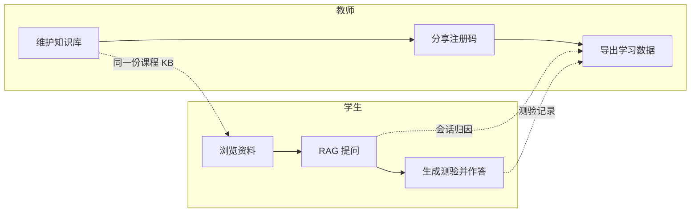
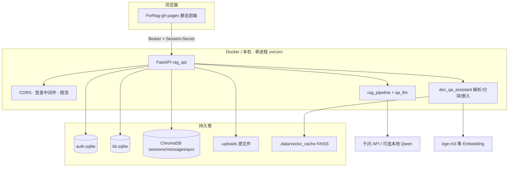

# HKU SOLO Bot 产品需求文档（PRD）

> **给三类读者的阅读指引**
>
> | 你是谁 | 建议先看 | 再深入 |
> |---|---|---|
> | **产品 / 课程负责人** | §1 一页纸 · §3 用户与场景 · §4 功能清单 | §8 验收 · §9 路线图 |
> | **研发 / 运维** | §5 架构 · §5.4–5.6 RAG 优化 · §6 API · §7 部署 | 附录 A/C 配置与本机回退 |
> | **教师 / 学生用户** | §1.2 · **§3.0 默认账号** · §3.3 使用流程 | §4 对应角色功能 |

---

## 文档信息

| 项 | 内容 |
|---|---|
| 产品对外名称 | **HKU Teacher-student Co-learning (SOLO) Bot** |
| 简称 | SOLO Bot |
| 工程代号 | ForRAG（仓库目录 `E:\For_RAG`） |
| 文档版本 | **V2.1**（在 V2.0 上补回演示账号、RAG 优化要点与部署/本机配置） |
| 文档日期 | 2026-07-15 |
| 产品阶段 | **已可部署的师生共学版**（鉴权、共享 KB、问答、测验、导出、Docker 均已落地） |
| 品牌资产 | `files/hku-logo.png`、`files/ece-logo.png`（前端 `ForRag-gh-pages/assets/`） |
| 关联文档 | `DEPLOY.md`（部署）· `docs/RAG_Optimization_Report.md`（检索优化）· `.env.example`（配置模板） |
| 前序文档 | 本文档取代旧版 V1.1 中「尚未实现」的表述，以当前代码为唯一事实来源 |

---

## 1. 一页纸：产品是什么

### 1.1 一句话定义

**SOLO Bot** 是面向港大 ECE 课程的师生共学助手：教师维护一门课的共享资料库，学生基于同一份资料提问（带引用）并生成测验，教师可导出提问与测验数据，形成「资料 → 答疑 → 练习 → 教学反馈」闭环。

### 1.2 你能做什么（按角色）

```text
教师                          学生
────────────                  ────────────
登录教师账号                  注册码自助注册 / 教师建号登录
维护课程知识库（可写）        浏览课程知识库（只读）
分享/重置学生注册码           基于资料提问（带引用）
创建/删除师生账号             会话内临时上传文件
导出提问 / 回答摘要 / 测验    从回答生成测验并作答
```

### 1.3 核心价值

| 痛点 | SOLO Bot 怎么解决 |
|---|---|
| 课件分散、查找慢 | 一门课一份共享知识库，分类笔记 + 附件 |
| 通用 AI 答非所问、无出处 | RAG 检索课程资料，回答带引用；相关度不足时明确降级提示 |
| 教师不清楚学生卡在哪 | 导出学生提问与测验结果（CSV / Excel） |
| 资料按人复制易不同步 | **禁止按学生复制整库**；教师写、学生读，同一份数据 |

### 1.4 明确不做（本阶段非目标）

- 企业级多租户 / 多组织管理  
- 校园 SSO / OAuth（当前为用户名 + 密码）  
- 多人实时协同编辑  
- 多进程 / 分布式高可用集群  
- 对答案正确率作绝对保证  

---

## 2. 产品目标与成功标准

### 2.1 产品目标

1. 教师能在几分钟内把课件/题目写入课程共享知识库。  
2. 学生能基于同一份资料获得可追溯的回答，并能生成/完成测验。  
3. 教师能导出答疑与测验数据，掌握提问热点与掌握情况。  
4. 界面体现 HKU / ECE 品牌（白底 + 绿色顶栏，中英切换）。  
5. 通过 Docker 在课程服务器上一键部署，师生用浏览器即可使用。  

### 2.2 成功标准（可验收）

| ID | 标准 | 现状 |
|---|---|---|
| S1 | Docker Compose 启动后，`GET /health` 正常，浏览器可打开落地页 | ✅ |
| S2 | 教师可写 KB，学生只读；学生写 KB 返回 403 | ✅ |
| S3 | 学生提问返回回答 + 引用/路由（资料依据或通识降级） | ✅ |
| S4 | 学生可从选中回答生成测验并判分 | ✅ |
| S5 | 教师可按时间筛选、预览并导出 xlsx/csv | ✅ |
| S6 | 未登录访问受保护 API 返回 401 | ✅ |

---

## 3. 用户、入口与主流程

### 3.1 角色定义

| 角色 | 代码值 | 谁来当 | 主入口 |
|---|---|---|---|
| 教师 | `teacher` | 任课教师；首个账号由 `ADMIN_*` 环境变量引导创建 | 落地页 → Teacher → `teacher.html` |
| 学生 | `student` | 选课学生；注册码自助注册或教师创建 | 落地页 → Student → 问答 / 资料库 / 测验 |
| 运维 | （无独立角色） | TA / 开发者，负责 Docker 与 `.env` | 服务器命令行 + `DEPLOY.md` |

> 无单独 `admin` 角色；引导账号即教师，具备账号管理与导出权限。

### 3.2 页面地图

| 页面 | 路径（静态） | 谁用 | 用途 |
|---|---|---|---|
| 落地页 | `/` · `landing.html` | 全部 | 选 Teacher / Student |
| 登录 / 注册 | `login.html?role=…` | 全部 | 教师仅登录；学生可注册 |
| 教师控制台 | `teacher.html` | 教师 | 入口卡片、注册码、用户管理 |
| 课程知识库 | `kb.html` | 师生 | 教师可写；学生只读 |
| 导出中心 | `export.html` | 教师 | 筛选 → 预览 → 下载 |
| 问答助手 | `index.html` | 学生为主 | 会话问答、临时上传、出题入口 |
| 测验页 | `quiz.html` | 学生 | 作答与查看判分结果 |

### 3.0 默认账号与注册码（演示 / 开课速查）

> **安全提示：** 下列为课程内演示与本地联调约定。正式对公网或校园网开放前，**必须**在 `.env` 中改掉管理员密码，并轮换注册码；切勿把真实 `DASHSCOPE_API_KEY` 写进文档或提交进 Git。

| 用途 | 约定值 | 环境变量 / 说明 |
|---|---|---|
| 引导教师用户名 | `admin` | `ADMIN_USERNAME`（`.env.example` 同此） |
| 引导教师密码（历史演示约定） | `123456` | 旧版 PRD / 联调常用；**`.env.example` 模板为 `change-me-please`，部署时二选一写进 `.env`，开课后立刻改掉** |
| 教师显示名 | `Course Teacher` | `ADMIN_DISPLAY_NAME` |
| 学生课程注册码（历史演示约定） | `SOLO2026` | `STUDENT_REGISTER_CODE`；若留空则启动时**自动生成**，教师控制台可查看 / 轮换 |
| 登录令牌有效期 | 7 天 | `RAG_AUTH_TOKEN_TTL=604800` |
| 强制登录 | 开启 | `RAG_REQUIRE_AUTH=1`（共享机强烈建议） |

**首次登录路径：**

1. 运维在 `.env` 配好上表与 `DASHSCOPE_API_KEY` 后 `docker compose up -d --build`。  
2. 教师：落地页 → Teacher → 用户名 `admin` + 所配密码 → 教师控制台。  
3. 学生：落地页 → Student → 用注册码（如 `SOLO2026` 或控制台当前码）自助注册，或使用教师代建账号。  

> 引导账号仅在**库中尚不存在同名用户**时由启动逻辑创建一次；改 `.env` 密码**不会**自动重置已有用户，需教师控制台重建或清库（慎用）。

### 3.3 主流程（用户视角）

#### 场景 A — 开课部署（运维 + 教师）

1. 复制 `.env.example` → `.env`，填写 `DASHSCOPE_API_KEY`；将管理员设为约定演示值或更强密码（见 §3.0）。  
2. `docker compose up -d --build`，打开 `http://<服务器>:8000/`。  
3. 教师用 `admin` 登录 → 上传课件到知识库 → 在控制台确认注册码并分享给学生。  

#### 场景 B — 学生答疑与练习

1. 学生选 Student → 用注册码（演示常用 `SOLO2026`）注册，或用教师创建的账号登录。  
2. 在问答页提问；系统检索课程 KB（及可选会话临时文件），返回答案与引用。  
3. 选中助手回答 → 生成测验 → 作答 → 查看判分。  

#### 场景 C — 教师复盘

1. 教师打开导出中心。  
2. 选时间范围（今天 / 7 天 / 30 天 / 自定义），勾选模块（提问默认开、回答摘要可选、测验默认开）。  
3. 预览确认 → 下载 Excel 或 CSV。  



---

## 4. 功能需求

### 4.1 权限矩阵

| 能力 | 教师 | 学生 |
|---|:---:|:---:|
| 浏览课程知识库 | ✓ | ✓ 只读 |
| 创建/编辑/删除类目、笔记、附件 | ✓ | ✗ |
| 上传资料到课程 KB | ✓ | ✗ |
| 会话内临时上传（不进课程 KB） | 可（非主流程） | ✓ |
| RAG 提问 / 看引用 | 可进学生页（非主推） | ✓ |
| 生成测验 / 作答 / 判分 | — | ✓ |
| 查看/重置注册码 | ✓ | ✗ |
| 创建/删除用户 | ✓ | ✗ |
| 导出预览与下载 | ✓ | ✗ |

前端：`auth.js` 的 `requireRole` 阻挡学生打开教师页；后端对写 KB、管理、导出统一 `require_teacher`，越权 **403**。

### 4.2 身份与账号

| 需求 | 说明 |
|---|---|
| 登录 | 用户名 + 密码；返回令牌，前端存 `localStorage` 键 `RAG_ACCESS_TOKEN` |
| 密码存储 | PBKDF2-HMAC-SHA256，200k rounds |
| 令牌有效期 | `RAG_AUTH_TOKEN_TTL`，默认 7 天 |
| 强制登录 | `RAG_REQUIRE_AUTH=1`（共享部署强烈建议开启） |
| 引导教师 | 首次启动按 `ADMIN_*` 创建；演示约定见 **§3.0**（`admin` / 所配密码） |
| 学生注册 | 需有效课程注册码；可填显示名、学号；教师不可自助注册 |
| 注册码 | `STUDENT_REGISTER_CODE`（演示常用 `SOLO2026`）或启动时自动生成；教师控制台可查看 / 轮换 |

### 4.3 课程共享知识库

**原则：一门课一份共享 KB（当前 `kb_id=default`），教师写、学生读，不按学生复制。**

| 层级 | 说明 |
|---|---|
| 类目（Category） | 资料分组 |
| 笔记（Note） | 含 Markdown 正文 |
| 附件（Attachment） | 挂在笔记下的文件 |

**支持解析类型（与引擎对齐）：** PDF、DOCX、PPTX、Markdown、表格（xlsx/csv）、常见图片（OCR）等。  

**学生体验：**

- 知识库页无写操作控件；API 写接口对非教师 403。  
- 问答默认检索范围 `union`（课程 KB + 本会话临时文件）；也可仅会话文件或仅 KB。  
- 会话临时文件**不写入**课程 KB；删除会话后一并清理。删除会话**不会**删除课程 KB。  

### 4.4 RAG 问答

| 项 | 要求 |
|---|---|
| 输入 | 问题文本；可选检索范围 `kb_scope`：`session_files` / `kb_only` / `union` |
| 输出 | `answer`、命中片段 `hits`、引用 `citations`、路由 `route`、是否资料相关等 |
| 依据不足 | 允许通识回答，但必须给出明确提示（如无资料依据 / 依据有限） |
| 同步 / 异步 | 支持同步 `/qa` 与异步 `/qa/async` + 轮询 job |
| 会话安全 | 学习会话需 `X-Session-Secret`；登录开启时还需 Bearer 令牌 |
| 归因 | 创建会话时写入 `owner`（用户名/显示名/学号/角色），供导出使用 |

### 4.5 测验

| 项 | 要求 |
|---|---|
| 生成 | 学生选中一条或多条助手消息片段 → 生成测验 |
| 题量上限 | `RAG_MAX_QUIZ_QUESTIONS`（代码侧硬顶 ≤40） |
| 作答页 | 不展示标准答案；提交后 LLM 判分并返回解析 |
| 持久化 | 题目批次与作答写入服务端，供教师导出 |

### 4.6 教师导出

| 模块 | 默认 | 最小字段 |
|---|---|---|
| 学生提问 | 开 | 时间、学生标识、会话 ID、问题文本 |
| 系统回答摘要 | 关（可选） | 时间、学生标识、问题、回答摘要、是否资料依据/降级 |
| 测验汇总 | 开 | 时间、学生标识、题干、题型、选项、标准答案、学生作答、正误 |

**流程：** 筛选（时间预设 / 自定义）→ 勾选模块 → **预览** → 选 `xlsx` 或 `csv` → 下载。  
预览与导出范围、字段一致（所见即所得）。学生调用导出 API → 403。  

> 注：请求体中的 `course_ids` 为多课程预留字段，**当前忽略**（单课程 `default`）。

### 4.7 品牌与界面

| 项 | 要求 |
|---|---|
| 名称 | HKU Teacher-student Co-learning (SOLO) Bot |
| 视觉 | 白底；HKU 风格深绿顶栏；展示 HKU + ECE logo |
| 语言 | 默认英文；中英切换（`brand.js` / `data-i18n`），选择记忆在浏览器 |
| 技术 | 静态 HTML/CSS/JS（`ForRag-gh-pages/`），由 FastAPI 托管 |

---

## 5. 系统架构（研发）

### 5.1 总体架构



### 5.2 代码职责一览

```text
For_RAG/
├─ fastapi_service.py          # 兼容入口 → rag_api.main:app
├─ rag_api/                    # HTTP、鉴权、会话问答、导出、配置
│  ├─ main.py / routes.py / schemas.py / settings.py
│  ├─ auth.py / auth_routes.py
│  ├─ export_routes.py / export_service.py
│  ├─ qa_llm.py / session_qa.py
│  └─ middleware.py
├─ rag_pipeline.py             # 改写 / HyDE / 混合检索 / 重排 / Corrective
├─ doc_qa_assistant.py         # 解析、分块、Embedding、索引
├─ chroma_store.py             # 会话、消息、测验
├─ kb_store.py                 # 课程 KB 元数据（SQLite）
├─ auth_store.py               # 用户、令牌、注册码
├─ ForRag-gh-pages/            # 静态前端
├─ tools/rag_eval.py           # 离线评测
├─ Dockerfile / docker-compose.yml
├─ .env.example / DEPLOY.md
└─ docs/                       # 本 PRD 与优化报告等
```

### 5.3 数据落盘

| 数据 | 存储 | 默认位置 |
|---|---|---|
| 用户 / 令牌 / 注册码 | SQLite | `.data/auth.sqlite` |
| KB 类目 / 笔记 / 附件元数据 | SQLite | `.data/kb.sqlite` |
| 会话、消息、测验 | ChromaDB | `.data/chroma/` |
| 上传原文件 | 文件系统 | `.uploads/`（含 `kb/{kb_id}/`） |
| 向量缓存 | FAISS 等 | `.data/vector_cache/` |
| Embedding 模型缓存 | Docker 命名卷 | `hf-cache` → `HF_HOME` |

**备份 / 迁移必须同时保留 `.data` 与 `.uploads`。**

### 5.4 RAG 主链路（实现要点）

1. **范围收集**：按 `kb_scope` 汇总会话文件与课程 KB 文档。  
2. **解析分块**：边界感知分块（段/句/词）；可选 Contextual Headers（仅用于嵌入/BM25，不进入证据正文）。  
3. **检索**：多查询改写 → HyDE（稠密）→ Dense + BM25 → RRF → Cross-Encoder 重排 → 可选 Corrective 再检索（最多 1 次）。  
4. **生成门控（CRAG 风格）**：`none` / `weak` / `grounded`；不足则通识降级并提示。  
5. **呈现**：Lost-in-the-Middle 重排证据；句级 `[n]` 引用；落库消息供前端与导出。  

默认 Embedding：`BAAI/bge-m3`；默认重排：`BAAI/bge-reranker-v2-m3`；LLM：DashScope 兼容接口（默认 `qwen-plus`）。开关见附录 A / C。

### 5.5 已落地的 RAG 重要优化点（Before → After）

> 完整方法论、论文依据与代码锚点见 [`docs/RAG_Optimization_Report.md`](RAG_Optimization_Report.md)。下表为产品/研发共用的「改了什么、为何重要」。

| # | 环节 | 优化前 | 现在（默认） | 为何重要 | 开关 |
|---|---|---|---|---|---|
| 1 | 嵌入 | 中文小模型 `bge-small-zh-v1.5` | 多语种 `BAAI/bge-m3`（8192 上下文）；低配可回退小模型 | 英文/双语课件与提问表示更稳 | `MS_EMBED_ID` |
| 2 | 语境头 | 块=原文 | Contextual Retrieval：块加 `Document/Location/meta`（仅检索用） | 降低「脱离章节语境」的检索歧义 | `RAG_CONTEXTUAL_HEADERS=1` |
| 3 | 查询理解 | 无 | Multi-query 改写 + HyDE 假想答案 | 口语问法与课件术语对齐，召回更全 | `RAG_ENABLE_REWRITE` / `HYDE` |
| 4 | 召回 | 仅稠密 top-k | Dense + BM25 + **RRF** 融合 | 术语/编号靠稀疏补足；融合免调权重 | `RAG_ENABLE_HYBRID` |
| 5 | 重排 | 无 | Cross-encoder `bge-reranker-v2-m3`（失败自动降级） | 「召回有、排序差」时把相关块顶上来 | `RAG_ENABLE_RERANK` |
| 6 | 门控 | 单一余弦阈值 | CRAG 三档 `none/weak/grounded` + 证据精炼 | 弱证据可答但标明局限，减少硬套/误杀 | 阈值见 `.env.example` |
| 7 | 证据顺序 | 相似度降序 | Lost-in-the-Middle：强证据放首尾 | 缓解长上下文中段遗忘 | 内置 |
| 8 | 引用 | 段落级弱约束 | **句级** `[k]` 引用 | 可核对、抗幻觉，适合课业场景 | 内置 prompt |
| 9 | 分块 | 定长硬切 | 边界感知（段/句/词），`CACHE_VERSION=rag_cache_v4` | 少截断概念，改善嵌入与 BM25 | 内置 |
| 10 | 纠错检索 | 无 | 首轮偏弱则改写再检一次（硬上限 1） | 低成本提升难例；控制延迟 | `RAG_ENABLE_CORRECTIVE` |
| 11 | 测验 | 直接出选项 | Bloom 难度分层 + 干扰项过量再筛 | 题目区分度更好 | 内置 prompt |
| 12 | 评估 | 无 | `tools/rag_eval.py`（忠实度/相关性/上下文精确·召回/命题正确性） | 改动能做回归，避免「感觉变好」 | 离线工具 |

**端到端管线（摘要）：**

```text
文档 → 边界感知分块 → 语境头 → 嵌入 + BM25 索引
用户问题 → Multi-query + HyDE → Dense/BM25 → RRF → 重排
         →（可选）纠错重查 ×1 → CRAG 门控 → LiM 证据序 → 句级引用生成
```

### 5.6 模型与硬件建议

| 用途 | 课程服务器（如 RTX 5060）推荐 | 本机低配（约 8GB 内存、纯 CPU）回退 |
|---|---|---|
| 嵌入 | `BAAI/bge-m3`（约 2.3GB） | `BAAI/bge-small-zh-v1.5` |
| 重排 | `BAAI/bge-reranker-v2-m3` | `RAG_ENABLE_RERANK=0`（或改用本地小模型路径，如 MiniLM） |
| 生成 LLM | DashScope `qwen-plus`（走 API） | 同左（不占本机显存） |

**说明：** `bge-m3` + 重排同时加载约需 ~4.5GB，低内存本机有 OOM 风险；生产默认按「大模型 + 开重排」，本机联调按附录 C 一键回退。换嵌入模型会按新 `embed_model_id` **自动重建向量缓存**。嵌入/重排可自托管；付费项主要是生成 API。

### 5.7 关键约束（设计决策）

| 约束 | 原因 / 影响 |
|---|---|
| **单 uvicorn worker** | Chroma / SQLite / 进程内状态非多副本安全 |
| **单课程 `RAG_KB_ID=default`** | API 形态已按 session 挂 KB，但 KB 全局共享；多课为后续（原 M2 目标，见 §9） |
| **异步 QA job 存内存** | 进程重启后未完成任务丢失 |
| **公网需反代 HTTPS** | 镜像本身不内置证书终结 |
| **改写+HyDE 有额外 LLM 调用** | 每问约多 1 次调用；可用开关关闭以换延迟/成本 |

---

## 6. API 与数据模型（研发）

前缀：`/api/v1`。健康检查：`GET /health`。

### 6.1 鉴权

| 方法 | 路径 | 说明 |
|---|---|---|
| GET | `/auth/config` | `{ auth_required, registration_open }` |
| POST | `/auth/login` | 登录发令牌 |
| POST | `/auth/register` | 学生注册并登录（需注册码） |
| GET | `/auth/me` | 当前用户 |
| POST | `/auth/logout` | 吊销令牌 |

### 6.2 教师管理与导出

| 方法 | 路径 | 说明 |
|---|---|---|
| GET/POST | `/admin/users` | 列出 / 创建用户 |
| DELETE | `/admin/users/{user_id}` | 删除用户 |
| GET/POST | `/admin/registration-code` | 查看 / 轮换注册码 |
| POST | `/admin/export/preview` | 导出预览 |
| POST | `/admin/export/file` | 下载 CSV / XLSX |

### 6.3 会话与学习

| 方法 | 路径 | 说明 |
|---|---|---|
| POST | `/sessions` | 创建会话（写入 owner） |
| DELETE | `/sessions/{sid}` | 删会话（不删课程 KB） |
| GET/POST | `/sessions/{sid}/files` | 会话临时文件 |
| * | `/sessions/{sid}/kb/...` | 类目 / 笔记 / 附件（写：教师） |
| POST | `/sessions/{sid}/qa` | 同步问答 |
| POST | `/sessions/{sid}/qa/async` | 异步问答 |
| GET | `/sessions/{sid}/qa/jobs/{job_id}` | 任务状态 |
| GET/DELETE | `/sessions/{sid}/messages...` | 消息历史 |
| POST | `/sessions/{sid}/quiz/generate` | 生成测验 |
| GET | `/sessions/{sid}/quiz/{quiz_id}` | 取题（无答案） |
| POST | `/sessions/{sid}/quiz/{quiz_id}/grade` | 判分 |

会话类请求需请求头 **`X-Session-Secret`**；开启鉴权时另需 **`Authorization: Bearer <token>`**。

### 6.4 数据模型要点

**auth.sqlite**

- `users`：`username`, `password_hash`, `role`∈{`teacher`,`student`}, `display_name`, `student_no`, …  
- `auth_tokens`：`token_hash`, `user_id`, `expires_at`  
- `app_config`：如注册码  

**kb.sqlite**

- `kb_categories` / `kb_notes` / `kb_note_files`，按 `kb_id` 作用域  

**Chroma**

- `sessions`（含 `owner`）、`session_files`、`messages`、`quiz_batches`、`quiz_answers`  

---

## 7. 部署与运维

详细步骤见仓库根目录 [`DEPLOY.md`](../DEPLOY.md)。摘要如下：

```bash
cp .env.example .env          # 填写密钥与管理员账号
docker compose up -d --build
curl http://localhost:8000/health
# 浏览器打开 http://<host>:8000/
```

| 运维要点 | 说明 |
|---|---|
| 端口 | 容器内 8000；主机端口 `HOST_PORT`（默认 8000） |
| 持久化 | 挂载 `./.data`、`./.uploads`、命名卷 `hf-cache` |
| 更新 | `git pull` 后 `docker compose up -d --build`（数据卷保留） |
| HTTPS | 公网务必用 Caddy / Nginx 反代 TLS；局域网可用 HTTP |
| GPU | 默认 CPU Torch；GPU 需自换 CUDA 镜像与运行时 |
| 限流 | `RAG_RATE_LIMIT_MAX_REQUESTS` / `WINDOW_SECONDS` |

---

## 8. 验收清单

### 8.1 产品验收

- [ ] 落地页展示产品全称与 Teacher / Student 入口，品牌为 HKU 绿白风格  
- [ ] 教师可维护 KB；学生界面无写控件，API 写操作 403  
- [ ] 学生提问有引用或明确的无依据/弱依据提示  
- [ ] 学生可生成测验、作答、看到判分结果  
- [ ] 教师可预览并导出提问 /（可选）回答摘要 / 测验为 xlsx 与 csv  
- [ ] 学生无法访问导出与用户管理  
- [ ] 中英切换后主要文案同步更新  

### 8.2 工程验收

- [ ] `docker compose up -d --build` 后健康检查通过  
- [ ] `RAG_REQUIRE_AUTH=1` 时未登录 API → 401  
- [ ] 重启容器后 `.data` / `.uploads` 中用户、KB、会话数据仍在  
- [ ] 单 worker 文档与 compose 配置一致，未误配多副本  

---

## 9. 版本现状与路线图

### 9.1 里程碑对照（承接旧版 V1.1）

| 里程碑 | 原规划内容 | 当前状态 |
|---|---|---|
| **M1** 师生功能走通 | 角色、共享 KB、问答、测验、导出预览 | ✅ 已交付 |
| **M2** Docker 可交付 + 多课程隔离 | Compose 上线；每门课独立 `course_id` | ⚠️ Docker / 持久化 ✅；**多课程仍待做**（现仅 `default`） |
| **M3** 开课加固 | HTTPS、去硬编码密钥、限流、越权验收 | ⚠️ 限流/鉴权/去硬编码 Key ✅；公网 HTTPS 手册与生产 CORS 收紧仍待完善 |

### 9.2 当前版本（V2.0 已交付）

- 师生角色与登录 / 学生注册码（演示约定见 §3.0）  
- 课程共享知识库（单课 `default`）  
- 学生 RAG 问答（§5.5 全套优化）+ 会话临时上传  
- 测验生成与判分（Bloom + 干扰项筛选）  
- 教师导出（预览 + CSV/XLSX，`openpyxl`）  
- HKU / ECE 品牌壳与中英 i18n  
- Docker / Compose 一键部署  
- 离线评测工具 `tools/rag_eval.py`  

### 9.3 已确认的产品决策（历史收敛，勿回退）

1. 一门课一份共享 KB，教师写、学生读，**不按学生复制整库**。  
2. 界面**默认英文**，支持中英切换。  
3. 学生**允许**会话临时上传（不入课程 KB）。  
4. 导出：筛选 → **预览** → CSV/Excel；回答摘要可选；测验字段必达；Excel 使用 `openpyxl`。  
5. 正式使用路径以 **Docker** 为准。  
6. 多课程隔离为明确目标（原定 M2）；**实现上尚未完成**，导出请求里的 `course_ids` 暂忽略。  

### 9.4 下一阶段（建议优先级）

| 优先级 | 项 | 说明 |
|---|---|---|
| P0 | 公网 HTTPS 落地手册 | 反代模板、域名、证书；开课前改默认密码/注册码 |
| P1 | 多课程 `course_id`（补齐 M2） | KB / 会话 / 导出按课隔离；启用 `course_ids` |
| P1 | 异步 QA 任务持久化 | 避免重启丢 job |
| P2 | 校园 SSO / OAuth | 替换或补充账密 |
| P2 | 跨设备会话列表 | 服务端会话列表，而非仅浏览器本地 |
| P2 | 生产 CORS 收紧 | `RAG_CORS_STRICT=1` + 白名单 |
| P3 | 检索继续打磨 | LLM 语境头、语义/版面分块、多跳纠错、评测校准（见优化报告 §9） |

---

## 10. 术语表

| 术语 | 含义 |
|---|---|
| SOLO Bot | 产品对外名称 |
| ForRAG | 工程仓库代号 |
| 课程 KB / 共享知识库 | 教师维护、学生只读检索的课程资料集合 |
| 会话临时文件 | 仅当前学习会话可检索的上传，不进课程 KB |
| RAG | Retrieval-Augmented Generation，检索增强生成 |
| RRF | Reciprocal Rank Fusion，多路检索融合 |
| CRAG 门控 | 按检索质量决定 grounded / weak / none 路由 |
| HyDE | 先让 LLM 写假想答案再作稠密检索，缓解问-答词面差 |
| Contextual Retrieval | 为 chunk 加文档/位置语境头，仅用于检索 |
| 注册码 | 学生自助注册口令；演示常用 `SOLO2026` |
| owner | 会话上的学生归因元数据，用于导出 |

---

## 附录 A — 关键环境变量

完整模板见 [`.env.example`](../.env.example)。

| 变量 | 用途 |
|---|---|
| `DASHSCOPE_API_KEY` | 千问 API 密钥（问答与出题必需） |
| `QWEN_API_MODEL` / `QWEN_API_BASE` | 模型名与兼容接口地址 |
| `RAG_REQUIRE_AUTH` | 是否强制登录 |
| `RAG_AUTH_TOKEN_TTL` | 登录令牌秒数 |
| `ADMIN_USERNAME` / `ADMIN_PASSWORD` / `ADMIN_DISPLAY_NAME` | 引导教师；演示见 §3.0（常用 `admin` + 自设密码） |
| `STUDENT_REGISTER_CODE` | 初始注册码（演示常用 `SOLO2026`；可空=自动生成） |
| `HOST_PORT` | 主机映射端口 |
| `RAG_CORS_STRICT` / `RAG_ALLOWED_ORIGINS` | CORS 策略 |
| `RAG_MAX_FILES` / `RAG_MAX_FILE_MB` | 上传限制 |
| `RAG_MAX_TOP_K` / `RAG_MAX_QUESTION_CHARS` | 检索与问题长度 |
| `RAG_RATE_LIMIT_*` | 限流 |
| `MS_EMBED_ID` | Embedding 模型（默认 bge-m3） |
| `RAG_ENABLE_REWRITE` / `HYDE` / `RERANK` / `CORRECTIVE` | 检索质量开关 |
| `RAG_RERANK_MODEL` | 重排模型 |
| `RAG_CONTEXTUAL_HEADERS` | 分块上下文头 |
| `RAG_ENABLE_LOCAL_LLM` | 是否加载本地 LLM（Docker 默认关） |
| `RAG_CLEAR_CACHE_ON_SHUTDOWN` | 关机是否清空向量缓存（Docker 默认保留） |

---

## 附录 B — 快速对照：三类读者「我该干什么」

| 角色 | 第一步 | 日常动作 | 别做的事 |
|---|---|---|---|
| **教师** | `admin` + 所配密码登录教师端（§3.0） | 管 KB、发注册码、定期导出 | 不必替学生日常提问；勿把演示密码用于公网 |
| **学生** | 落地页选 Student → 用注册码注册/登录 | 提问、临时上传、做测验 | 不要改课程资料库 |
| **研发/运维** | 配 `.env`（含 Key 与账号）+ `docker compose up` | 备份 `.data`+`.uploads`；按附录 C 调模型 | 不要多 worker；勿把真实 Key 写入 PRD/Git |

---

## 附录 C — 部署机 vs 本机：检索配置速查

与 [`RAG_Optimization_Report.md`](RAG_Optimization_Report.md) §6–§7 对齐，便于联调与开课切换：

| 变量 | 课程服务器（推荐） | 本机低配回退 | 含义 |
|---|---|---|---|
| `MS_EMBED_ID` | `BAAI/bge-m3` | `BAAI/bge-small-zh-v1.5` | 嵌入模型 |
| `RAG_ENABLE_RERANK` | `1` | `0` | 是否重排 |
| `RAG_RERANK_MODEL` | `BAAI/bge-reranker-v2-m3` | （关闭或本地 MiniLM 路径） | 重排模型 |
| `RAG_ENABLE_REWRITE` | `1` | `1`（可关省 API） | 多查询改写 |
| `RAG_ENABLE_HYDE` | `1` | `1`（可关省 API） | HyDE |
| `RAG_ENABLE_HYBRID` | `1` | `1` | 稠密+BM25 |
| `RAG_CONTEXTUAL_HEADERS` | `1` | `1` | 语境头 |
| `RAG_ENABLE_CORRECTIVE` | `1` | `1` | 单次纠错重查 |

其它可调：`RAG_HYBRID_CANDIDATES`(36)、`RAG_DENSE_PER_QUERY`(12)、`RAG_BM25_TOP`(20)、`RAG_RRF_K`(60)、`RAG_RERANK_MIN_SCORE` / `SINGLE` / `STRONG`、`RAG_KB_MIN_SCORE`（余弦回退）、`RAG_EVIDENCE_KEEP_RATIO`(0.25)。

离线回归示例：`python tools/rag_eval.py`（评测集见 `tools/eval_set*.json`，报告见 `docs/rag_eval_*`）。

---

*文档结束。实现细节以仓库代码与 `DEPLOY.md` 为准；若本文与代码冲突，以代码行为更新本文档。*
