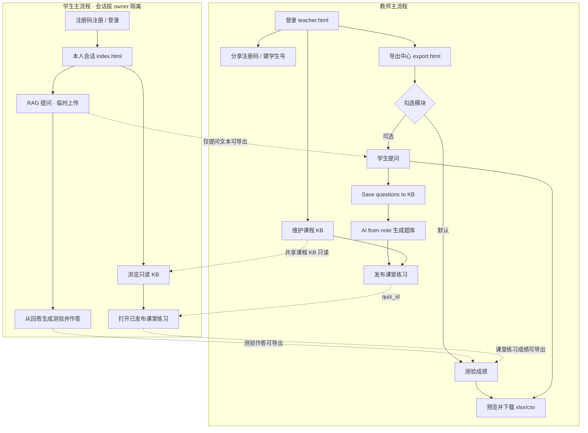
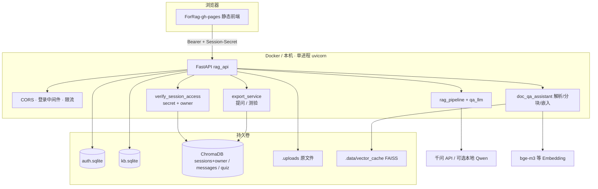

# HKU SOLO Bot 产品需求文档（PRD）

> **给三类读者的阅读指引**
>
> | 你是谁 | 建议先看 | 再深入 |
> |---|---|---|
> | **产品 / 课程负责人** | §1 一页纸 · §3 用户与场景 · §4 功能清单 | §8 验收 · §9 路线图 |
> | **研发 / 运维** | §5 架构 · §5.4–5.6 RAG 优化 · §6 API · **§7.1 本机启动** · §7.2 Docker | 附录 A/C 配置与本机回退 |
> | **教师 / 学生用户** | §1.2 · **§3.0 默认账号** · §3.3 使用流程 | §4 对应角色功能 |

---

## 文档信息

| 项 | 内容 |
|---|---|
| 产品对外名称 | **HKU Teacher-student Co-learning (SOLO) Bot** |
| 简称 | SOLO Bot |
| 工程代号 | ForRAG（仓库目录 `E:\For_RAG`） |
| 文档版本 | **V2.3**（e5 多语嵌入 + MiniLM 重排；token 分块/父子块/PDF OCR；门控充分性与引用覆盖） |
| 文档日期 | 2026-07-26 |
| 产品阶段 | **已可部署的师生共学版**（鉴权、共享 KB、问答、测验、导出、Docker 均已落地） |
| 品牌资产 | `files/hku-logo.png`、`files/ece-logo.png`（前端 `ForRag-gh-pages/assets/`） |
| 关联文档 | `DEPLOY.md`（部署）· `docs/architecture.md`（架构）· `docs/RAG_Optimization_Report.md`（检索优化）· `ForRag-gh-pages/README.md`（前端）· `.env.example`（配置模板） |
| 前序文档 | 本文档取代旧版 V1.1 中「尚未实现」的表述，以当前代码为唯一事实来源 |

---

## 1. 一页纸：产品是什么

### 1.1 一句话定义

**SOLO Bot** 是面向港大 ECE 课程的师生共学助手：教师维护一门课的共享资料库，学生基于同一份资料提问（带引用）并生成测验，教师可导出提问与测验数据，形成「资料 → 答疑 → 练习 → 教学反馈」闭环。

### 1.2 你能做什么（按角色）

```text
教师                          学生
────────────                  ────────────
登录教师账号                  注册码自助注册 / 教师建号登录
维护课程知识库（可写）        浏览课程知识库（只读）
分享/重置学生注册码           基于资料提问（带引用）
创建/删除师生账号             会话内临时上传文件
导出提问 / 测验成绩           从回答生成测验并作答
（不含完整对话）
```

### 1.3 核心价值

| 痛点 | SOLO Bot 怎么解决 |
|---|---|
| 课件分散、查找慢 | 一门课一份共享知识库，分类笔记 + 附件 |
| 通用 AI 答非所问、无出处 | RAG 检索课程资料，回答带引用；相关度不足时明确降级提示 |
| 教师不清楚学生卡在哪 | 导出学生提问与测验成绩（CSV / Excel；不含完整对话） |
| 资料按人复制易不同步 | **禁止按学生复制整库**；教师写、学生读，同一份数据 |

### 1.4 明确不做（本阶段非目标）

- 企业级多租户 / 多组织管理  
- 校园 SSO / OAuth（当前为用户名 + 密码）  
- 多人实时协同编辑  
- 多进程 / 分布式高可用集群  
- 对答案正确率作绝对保证  

---

## 2. 产品目标与成功标准

### 2.1 产品目标

1. 教师能在几分钟内把课件/题目写入课程共享知识库。  
2. 学生能基于同一份资料获得可追溯的回答，并能生成/完成测验。  
3. 教师能导出学生提问与测验成绩（不含完整对话），掌握提问热点与掌握情况。  
4. 界面体现 HKU / ECE 品牌（白底 + 绿色顶栏，中英切换）。  
5. 通过 Docker 在课程服务器上一键部署，师生用浏览器即可使用。  

### 2.2 成功标准（可验收）

| ID | 标准 | 现状 |
|---|---|---|
| S1 | Docker Compose 启动后，`GET /health` 正常，浏览器可打开落地页 | ✅ |
| S2 | 教师可写 KB，学生只读；学生写 KB 返回 403 | ✅ |
| S3 | 学生提问返回回答 + 引用/路由（有依据 / 通识降级 / 服务不可用可区分） | ✅ |
| S4 | 学生可从选中回答生成测验并判分 | ✅ |
| S5 | 教师可按时间筛选、预览并导出提问/测验为 xlsx/csv（不含对话正文） | ✅ |
| S6 | 未登录访问受保护 API 返回 401 | ✅ |

---

## 3. 用户、入口与主流程

### 3.1 角色定义

| 角色 | 代码值 | 谁来当 | 主入口 |
|---|---|---|---|
| 教师 | `teacher` | 任课教师；首个账号由 `ADMIN_*` 环境变量引导创建 | 落地页 → Teacher → `teacher.html` |
| 学生 | `student` | 选课学生；注册码自助注册或教师创建 | 落地页 → Student → 问答 / 资料库 / 测验 |
| 运维 | （无独立角色） | TA / 开发者，负责 Docker 与 `.env` | 服务器命令行 + `DEPLOY.md` |

> 无单独 `admin` 角色；引导账号即教师，具备账号管理与导出权限。

### 3.2 页面地图

| 页面 | 路径（静态） | 谁用 | 用途 |
|---|---|---|---|
| 落地页 | `/` · `landing.html` | 全部 | 选 Teacher / Student |
| 登录 / 注册 | `login.html?role=…` | 全部 | 教师仅登录；学生可注册 |
| 教师控制台 | `teacher.html` | 教师 | 入口卡片、注册码、用户管理 |
| 课程知识库 | `kb.html` | 师生 | 教师可写；学生只读；**课堂练习**上下架 / 答题入口 |
| 导出中心 | `export.html` | 教师 | 勾选模块（提问 / 测验）→ 预览 → 下载 xlsx/csv；**保存学生提问到知识库** |
| 问答助手 | `index.html` | 学生为主；教师可进但只看自己会话 | 会话问答、临时上传、出题入口 |
| 测验页 | `quiz.html` | 学生 | 作答与查看判分；支持 `?quiz_id=` 打开课堂练习 |

### 3.0 默认账号与注册码（演示 / 开课速查）

> **安全提示：** 下列为课程内演示与本地联调约定。正式对公网或校园网开放前，**必须**在 `.env` 中改掉管理员密码，并轮换注册码；切勿把真实 `DASHSCOPE_API_KEY` 写进文档或提交进 Git。

| 用途 | 约定值 | 环境变量 / 说明 |
|---|---|---|
| 引导教师用户名 | `admin` | `ADMIN_USERNAME`（`.env.example` 同此） |
| 引导教师密码（历史演示约定） | `123456` | 旧版 PRD / 联调常用；**`.env.example` 模板为 `change-me-please`，部署时二选一写进 `.env`，开课后立刻改掉** |
| 教师显示名 | `Course Teacher` | `ADMIN_DISPLAY_NAME` |
| 学生课程注册码（历史演示约定） | `SOLO2026` | `STUDENT_REGISTER_CODE`；若留空则启动时**自动生成**，教师控制台可查看 / 轮换 |
| 登录令牌有效期 | 7 天 | `RAG_AUTH_TOKEN_TTL=604800` |
| 强制登录 | 开启 | `RAG_REQUIRE_AUTH=1`（共享机强烈建议） |

**首次登录路径：**

1. 运维在 `.env` 配好上表与 `DASHSCOPE_API_KEY` 后 `docker compose up -d --build`。  
2. 教师：落地页 → Teacher → 用户名 `admin` + 所配密码 → 教师控制台。  
3. 学生：落地页 → Student → 用注册码（如 `SOLO2026` 或控制台当前码）自助注册，或使用教师代建账号。  

> 引导账号仅在**库中尚不存在同名用户**时由启动逻辑创建一次；改 `.env` 密码**不会**自动重置已有用户，需教师控制台重建或清库（慎用）。

### 3.3 主流程（用户视角）

#### 场景 A — 开课部署（运维 + 教师）

1. 复制 `.env.example` → `.env`，填写 `DASHSCOPE_API_KEY`；将管理员设为约定演示值或更强密码（见 §3.0）。  
2. `docker compose up -d --build`，打开 `http://<服务器>:8000/`。  
3. 教师用 `admin` 登录 → 上传课件到知识库 → 在控制台确认注册码并分享给学生。  

#### 场景 B — 学生答疑与练习

1. 学生选 Student → 用注册码（演示常用 `SOLO2026`）注册，或用教师创建的账号登录。  
2. 在问答页提问；系统检索课程 KB（及可选会话临时文件），返回答案与引用。  
3. 选中助手回答 → 生成测验 → 作答 → 查看判分。  

#### 场景 C — 教师复盘与课堂练习回流

1. 教师打开导出中心。  
2. 选时间范围（今天 / 7 天 / 30 天 / 自定义），勾选模块（**测验默认开**；学生提问默认关，需主动勾选）。**不导出**系统回答摘要或完整对话。  
3. 预览确认 → 下载 Excel 或 CSV；或点击 **Save questions to KB**，将学生提问写入课程知识库分类 `Student questions`（笔记正文 + 附件；此路径固定只含提问）。  
4. 在知识库打开该笔记 → **AI from note** 整理生成带答案题库 → 自动发布为课堂练习，并下载 Excel/CSV 题库文件。  
5. 也可直接在知识库「Class exercises」上传模板格式的 CSV/Excel 题库并发布；学生从知识库列表或 `quiz.html?quiz_id=…` 进入作答。  



> **读图要点：** 学生之间会话互不可见（Bearer 用户须 = 会话 owner）。教师看全班数据只走导出中心；**不导出**完整对话 / 回答摘要。助手页（含教师预览）只操作本人会话。

---

## 4. 功能需求

### 4.1 权限矩阵

| 能力 | 教师 | 学生 |
|---|:---:|:---:|
| 浏览课程知识库 | ✓ | ✓ 只读 |
| 创建/编辑/删除类目、笔记、附件 | ✓ | ✗ |
| 上传资料到课程 KB | ✓ | ✗ |
| 课堂练习：上传题库 / 上下架 / AI 出题 | ✓ | ✗ |
| 课堂练习：查看已发布并作答 | ✓ | ✓ |
| 导出学生提问到知识库 | ✓ | ✗ |
| 会话内临时上传（不进课程 KB） | 可（非主流程） | ✓ |
| RAG 提问 / 看引用 | 可进助手页（仅本人会话；非主推） | ✓ |
| 生成测验 / 作答 / 判分 | 可（本人会话） | ✓ |
| 查看/重置注册码 | ✓ | ✗ |
| 创建/删除用户 | ✓ | ✗ |
| 导出预览与下载 | ✓ | ✗ |

前端：`auth.js` 的 `requireRole` 阻挡学生打开教师页（教师可预览学生页，但会话数据按用户隔离）；后端对写 KB、管理、导出统一 `require_teacher`，越权 **403**。

### 4.2 身份与账号

| 需求 | 说明 |
|---|---|
| 登录 | 用户名 + 密码；返回令牌，前端存 `localStorage` 键 `HKU_LOGIN_TOKEN`（兼容迁移旧键 `RAG_ACCESS_TOKEN`）；与服务端环境变量静态 `RAG_ACCESS_TOKEN`（无登录时的机器门闩）分离 |
| 密码存储 | PBKDF2-HMAC-SHA256，200k rounds |
| 令牌有效期 | `RAG_AUTH_TOKEN_TTL`，默认 7 天 |
| 强制登录 | `RAG_REQUIRE_AUTH=1`（共享部署强烈建议开启） |
| 引导教师 | 首次启动按 `ADMIN_*` 创建；演示约定见 **§3.0**（`admin` / 所配密码） |
| 学生注册 | 需有效课程注册码；可填显示名、学号；教师不可自助注册 |
| 注册码 | `STUDENT_REGISTER_CODE`（演示常用 `SOLO2026`）或启动时自动生成；教师控制台可查看 / 轮换 |

### 4.3 课程共享知识库

**原则：一门课一份共享 KB（当前 `kb_id=default`），教师写、学生读，不按学生复制。**

| 层级 | 说明 |
|---|---|
| 类目（Category） | 资料分组 |
| 笔记（Note） | 标题 + 附件列表（无 Markdown 正文编辑） |
| 附件（Attachment） | 挂在笔记下的文件（可下载；教师可移除） |

**支持解析类型（与引擎对齐）：** PDF、DOCX、PPTX、Markdown、表格（xlsx/csv）、常见图片（OCR）等。  

**学生体验：**

- 知识库页以**附件列表与下载**为主，**不提供 Markdown 正文编辑**；无附件时提示暂无文件。  
- 学生无写操作控件；API 写接口对非教师 403。教师可改标题、上传/移除附件，并**删除整条笔记**（连带附件）。  
- 问答默认检索范围 `union`（课程 KB + 本会话临时文件）；也可仅会话文件或仅 KB。  
- 会话临时文件**不写入**课程 KB；删除会话后一并清理。删除会话**不会**删除课程 KB。  

### 4.4 RAG 问答

| 项 | 要求 |
|---|---|
| 输入 | 问题文本；可选检索范围 `kb_scope`：`session_files` / `kb_only` / `union` |
| 输出 | `answer`、命中片段 `hits`、引用 `citations`、路由 `route`、门控标签 `grounding_label`、回答类型 `answer_kind`、是否资料相关等 |
| 依据充足（grounded） | 用课件证据生成带句级 `[n]` 引用的回答；文末附后端拼装的「证据来源」 |
| 弱证据（weak） | 边界分数可先做一次 LLM **充分性判断**：够用则仍走课件 RAG；不够则通识回答 |
| 无依据（none）或通识 | 调用同一大模型作**通识回答**，并明确提示「不代表课程材料结论」；不把弱检索片段硬套成课件依据 |
| API 失败 | 不返回伪课件答案；`answer_kind=unavailable`，告知服务不可用 / 证据不足 |
| 引用覆盖 | 生成后检查句级引用覆盖率；过低则修订一次；仍不达标则**仍返回**课程依据答案并附来源清单（软提示引用可能不完整），不再整段拦截 |
| 检索条数 | 由服务端 `RAG_MAX_TOP_K`（默认 5）决定；前端**不再**提供 Chunks 下拉框 |
| 同步 / 异步 | 支持同步 `/qa` 与异步 `/qa/async` + 轮询 job |
| 会话安全 | 学习会话需 `X-Session-Secret`；登录开启时还需 Bearer 令牌，且 **调用者必须是会话 `owner`**（`verify_session_access`）；他人持正确 secret 亦 **403** |
| 归因与归属 | 创建会话时写入 `owner`（user_id / 用户名 / 显示名 / 学号 / 角色）；用于访问控制与导出归因；无 owner 的历史会话由首次合法访问者认领 |
| 前端会话列表 | 侧栏多会话缓存在 `RAG_CONVERSATIONS::<username>`；登出清理当前会话键与遗留全局列表 |

### 4.5 测验

| 项 | 要求 |
|---|---|
| 生成（会话） | 学生选中一条或多条助手消息片段 → 生成测验 |
| 课堂练习 | 教师上传 CSV/XLSX 题库（含答案）或由「学生提问」笔记 AI 生成；发布后全体学生可见 |
| 题库模板列 | `type, question, option1…option6, correct`（`tf`/`single`/`multi`） |
| 链接 | 一份题库 = 一套练习 = 一个 `quiz_id`；打开 `quiz.html?quiz_id=…` |
| 上下架 | 教师可 `published` / `unpublished`；下架后学生不可打开 |
| 题量上限（会话生成） | `RAG_MAX_QUIZ_QUESTIONS`（代码侧硬顶 ≤40） |
| 作答页 | 与生成测验同一套 Kahoot UI；不展示标准答案；提交后 LLM 判分 |
| 持久化 | 题目批次与作答写入服务端；课堂练习按 `{quiz_id}__{user_id}` 存多人作答，供教师导出 |

### 4.6 教师导出

**隐私原则：** 助手页只访问本人会话；学生数据仅通过导出中心主动勾选获取。导出 **不含** 完整对话与系统回答摘要（API 字段 `include_answers` 已忽略）。

| 模块 | 默认 | 最小字段 |
|---|---|---|
| 学生提问 | **关**（可勾选） | 时间、学生标识、会话 ID、问题文本 |
| 测验汇总 | **开** | 时间、学生标识、题干、题型、选项、标准答案、学生作答、正误 |
| ~~系统回答摘要~~ | **已移除** | 不再导出（请求中即使传 `include_answers=true` 亦忽略） |

**流程：** 筛选（时间预设 / 自定义）→ 勾选模块（提问 / 测验）→ **预览** → 选 `xlsx` 或 `csv` → 下载。  
**回流知识库：** 「Save questions to KB」将当前筛选下的学生提问写入分类 `Student questions`（Markdown 列表 + 原导出附件），供 AI 整理出题。  
预览与导出范围、字段一致（所见即所得）。学生调用导出 API → 403。  
**说明：** 测验条目若含 AI 生成的 `explanation`（解析），当前导出列 **尚未包含**；判分评语/`analysis` 亦不导出。

### 4.7 课堂练习与 AI 出题闭环

1. 教师导出学生提问 → 入库知识库。  
2. 在知识库打开该笔记 → AI 生成带答案题目 → 下载 Excel/CSV 题库，并/或直接发布为课堂练习。  
3. 学生在知识库「Class exercises」开始练习 → 判分结果可供再次导出。  

> 注：请求体中的 `course_ids` 为多课程预留字段，**当前忽略**（单课程 `default`）。

### 4.7 品牌与界面

| 项 | 要求 |
|---|---|
| 名称 | HKU Teacher-student Co-learning (SOLO) Bot |
| 视觉 | 白底；HKU 风格深绿顶栏；展示 HKU + ECE logo |
| 语言 | 默认英文；中英切换（`brand.js` / `data-i18n`），选择记忆在浏览器 |
| 技术 | 静态 HTML/CSS/JS（`ForRag-gh-pages/`），由 FastAPI 托管 |

---

## 5. 系统架构（研发）

### 5.1 总体架构



### 5.2 代码职责一览

```text
For_RAG/
├─ fastapi_service.py          # 兼容入口 → rag_api.main:app
├─ rag_api/                    # HTTP、鉴权、会话问答、导出、配置
│  ├─ main.py / routes.py / schemas.py / settings.py
│  ├─ auth.py / auth_routes.py
│  ├─ export_routes.py / export_service.py
│  ├─ qa_llm.py / session_qa.py
│  └─ middleware.py
├─ rag_pipeline.py             # 改写 / HyDE / 混合检索 / 重排 / Corrective
├─ doc_qa_assistant.py         # 解析、分块、Embedding、索引
├─ chroma_store.py             # 会话、消息、测验
├─ kb_store.py                 # 课程 KB 元数据（SQLite）
├─ auth_store.py               # 用户、令牌、注册码
├─ ForRag-gh-pages/            # 静态前端
├─ tools/rag_eval.py           # 离线评测
├─ Dockerfile / docker-compose.yml
├─ .env.example / DEPLOY.md
└─ docs/                       # 本 PRD 与优化报告等
```

### 5.3 数据落盘

| 数据 | 存储 | 默认位置 |
|---|---|---|
| 用户 / 令牌 / 注册码 | SQLite | `.data/auth.sqlite` |
| KB 类目 / 笔记 / 附件元数据 | SQLite | `.data/kb.sqlite` |
| 会话、消息、测验 | ChromaDB | `.data/chroma/` |
| 上传原文件 | 文件系统 | `.uploads/`（含 `kb/{kb_id}/`） |
| 向量缓存 | FAISS 等 | `.data/vector_cache/`（`parsed/` 解析缓存与 `docs/` 向量缓存分离） |
| Embedding 模型缓存 | Docker 命名卷 / 本机目录 | `hf-cache` → `HF_HOME`；本机亦可 `RAG_EMBED_MODEL_PATH` 指向本地权重 |

**备份 / 迁移必须同时保留 `.data` 与 `.uploads`。**

### 5.4 RAG 主链路（实现要点）

1. **范围收集**：按 `kb_scope` 汇总会话文件与课程 KB 文档。  
2. **解析分块**：token 口径分块（默认 480 token、15% 重叠）+ 段落边界 + 短块合并/去重 + **父子块**；PDF 文字层过少时 **图片页 OCR**；可选 Contextual Headers（仅用于嵌入/BM25）。解析结果缓存与向量缓存分离，换嵌入模型不重跑 OCR。  
3. **检索**：多查询改写（优先课件语言术语）→ HyDE → Dense + BM25 → RRF → Cross-Encoder 重排 → 可选 Corrective 再检索（最多 1 次）。英文 MiniLM 遇纯中文查询时跳过 CE，门控改用余弦阈值。  
4. **生成门控（CRAG 风格）**：`none` / `weak` / `grounded`；边界 weak 可经充分性判断晋升；否则通识降级并提示；引用覆盖率不达标则拦截。  
5. **呈现**：Lost-in-the-Middle 重排证据；连贯学术回答 + 句级 `[n]` 引用；后端附「证据来源」；落库消息供前端与导出。  

本机默认嵌入：`intfloat/multilingual-e5-small`；本机默认重排：本地 `ms-marco-MiniLM-L-6-v2`；GPU 部署可升到 `bge-m3` + `bge-reranker-v2-m3`。LLM：DashScope 兼容接口（默认 `qwen-plus`）。开关见附录 A / C。

### 5.5 已落地的 RAG 重要优化点（Before → After）

> 完整方法论、论文依据与代码锚点见 [`docs/RAG_Optimization_Report.md`](RAG_Optimization_Report.md)。下表为产品/研发共用的「改了什么、为何重要」。

| # | 环节 | 优化前 | 现在（默认） | 为何重要 | 开关 |
|---|---|---|---|---|---|
| 1 | 嵌入 | 中文小模型 `bge-small-zh-v1.5` | 本机 `multilingual-e5-small`；GPU 可升 `bge-m3`；E5 自动加前缀 | 英文课件 + 中英提问都能用；避免中文单语模型对英文虚高分 | `MS_EMBED_ID` / `RAG_EMBED_MODEL_PATH` |
| 2 | 语境头 | 块=原文 | Contextual Retrieval：块加 `Document/Location/meta`（仅检索用） | 降低「脱离章节语境」的检索歧义 | `RAG_CONTEXTUAL_HEADERS=1` |
| 3 | 查询理解 | 无 | Multi-query 改写 + HyDE；扩写优先课件术语语言 | 口语/中文问法对齐英文课件术语 | `RAG_ENABLE_REWRITE` / `HYDE` |
| 4 | 召回 | 仅稠密 top-k | Dense + BM25 + **RRF** 融合 | 术语/编号靠稀疏补足；融合免调权重 | `RAG_ENABLE_HYBRID` |
| 5 | 重排 | 无 | 本机 MiniLM；GPU 可 `bge-reranker-v2-m3`（失败自动降级） | 「召回有、排序差」时把相关块顶上来；压掉跑题虚高分 | `RAG_ENABLE_RERANK` |
| 6 | 门控 | 单一余弦阈值 | CRAG 三档 + **充分性判断** + 证据精炼；重排/余弦两套阈值 | 严谨：不够依据走通识；边界题可补召回 | 阈值见 `.env.example` |
| 7 | 证据顺序 | 相似度降序 | Lost-in-the-Middle：强证据放首尾 | 缓解长上下文中段遗忘 | 内置 |
| 8 | 引用 | 段落级弱约束 | **句级** `[k]` + **覆盖率检查/修订**；不足则软放行+来源清单 | 可核对、可用 | `RAG_MIN_CITATION_COVERAGE` |
| 9 | 分块 | 定长硬切 / 字符口径 | token 口径 + 短块合并去重 + 父子块，`CACHE_VERSION=rag_cache_v6` | 英文块信息量够；命中小块可展开整页 | `RAG_CHUNK_*` |
| 10 | PDF 解析 | 仅文字层 | 文字过少页 → RapidOCR 兜底 | 扫描件/整页图片讲义可检索 | `RAG_PDF_OCR*` |
| 11 | 纠错检索 | 无 | 首轮偏弱则改写再检一次（硬上限 1） | 低成本提升难例；控制延迟 | `RAG_ENABLE_CORRECTIVE` |
| 12 | 测验 | 直接出选项 | Bloom 难度分层 + 干扰项过量再筛 | 题目区分度更好 | 内置 prompt |
| 13 | 评估 | 无 | `tools/rag_eval.py`（含 `--grounding-only` 阈值标定） | 改动能做回归与门控校准 | 离线工具 |

**端到端管线（摘要）：**

```text
文档 → 解析(+OCR) → token 分块/短块治理/父子块 → 语境头 → 嵌入 + BM25
用户问题 → Multi-query + HyDE → Dense/BM25 → RRF → 重排
         →（可选）纠错重查 ×1 → CRAG 门控(+充分性) → LiM → 句级引用生成(+覆盖率)
```

### 5.6 模型与硬件建议

| 用途 | 课程服务器（如 RTX 5060）推荐 | 本机低配（约 8GB 内存、纯 CPU） |
|---|---|---|
| 嵌入 | `BAAI/bge-m3`（约 2.3GB） | `intfloat/multilingual-e5-small`（约 0.5GB，本地路径） |
| 重排 | `BAAI/bge-reranker-v2-m3` | 本地 `ms-marco-MiniLM-L-6-v2`（约 90MB，`RAG_ENABLE_RERANK=1`） |
| 生成 LLM | DashScope `qwen-plus`（走 API） | 同左（不占本机显存） |
| 编码批大小 | 默认即可 | `RAG_EMBED_BATCH_SIZE=2`（防 OOM） |

**说明：** `bge-m3` + 大型重排同时加载约需 ~4.5GB，8GB 本机易 OOM，故本机用 e5-small + MiniLM。换嵌入模型会按新 `embed_model_id` **重建向量缓存**，但**不必重跑 OCR**（解析缓存独立）。嵌入/重排可自托管；付费项主要是生成 API。

### 5.7 关键约束（设计决策）

| 约束 | 原因 / 影响 |
|---|---|
| **单 uvicorn worker** | Chroma / SQLite / 进程内状态非多副本安全 |
| **单课程 `RAG_KB_ID=default`** | API 形态已按 session 挂 KB，但 KB 全局共享；多课为后续（原 M2 目标，见 §9） |
| **异步 QA job 存内存** | 进程重启后未完成任务丢失 |
| **公网需反代 HTTPS** | 镜像本身不内置证书终结 |
| **改写+HyDE 有额外 LLM 调用** | 每问约多 1 次调用；可用开关关闭以换延迟/成本 |

---

## 6. API 与数据模型（研发）

前缀：`/api/v1`。健康检查：`GET /health`。

### 6.1 鉴权

| 方法 | 路径 | 说明 |
|---|---|---|
| GET | `/auth/config` | `{ auth_required, registration_open }` |
| POST | `/auth/login` | 登录发令牌 |
| POST | `/auth/register` | 学生注册并登录（需注册码） |
| GET | `/auth/me` | 当前用户 |
| POST | `/auth/logout` | 吊销令牌 |

### 6.2 教师管理与导出

| 方法 | 路径 | 说明 |
|---|---|---|
| GET/POST | `/admin/users` | 列出 / 创建用户 |
| DELETE | `/admin/users/{user_id}` | 删除用户 |
| GET/POST | `/admin/registration-code` | 查看 / 轮换注册码 |
| POST | `/admin/export/preview` | 导出预览 |
| POST | `/admin/export/file` | 下载 CSV / XLSX |
| POST | `/admin/export/save-to-kb` | 将学生提问写入课程 KB（`Student questions`） |

### 6.2b 课堂练习

| 方法 | 路径 | 说明 |
|---|---|---|
| GET | `/kb/exercises` | 列表（学生仅 published） |
| POST | `/kb/exercises/import` | 教师上传 CSV/XLSX 题库 |
| PATCH/DELETE | `/kb/exercises/{id}` | 上下架 / 改标题 / 删除 |
| GET | `/kb/exercises/template.csv` / `template.xlsx` | 题库模板 |
| POST | `/kb/exercises/generate-from-note` | 从学生提问笔记 AI 出题（可 publish） |
| POST | `/kb/exercises/export-bank` | 题库导出为 CSV/XLSX |
| GET | `/quiz/{quiz_id}` | 取公开题包（课堂练习） |
| POST | `/quiz/{quiz_id}/grade` | 课堂练习判分（按用户存答） |

### 6.3 会话与学习

| 方法 | 路径 | 说明 |
|---|---|---|
| POST | `/sessions` | 创建会话（写入 owner） |
| DELETE | `/sessions/{sid}` | 删会话（不删课程 KB） |
| GET/POST | `/sessions/{sid}/files` | 会话临时文件 |
| * | `/sessions/{sid}/kb/...` | 类目 / 笔记 / 附件（写：教师；`GET .../files/{fid}` 师生可下载） |
| POST | `/sessions/{sid}/qa` | 同步问答 |
| POST | `/sessions/{sid}/qa/async` | 异步问答 |
| GET | `/sessions/{sid}/qa/jobs/{job_id}` | 任务状态 |
| GET/DELETE | `/sessions/{sid}/messages...` | 消息历史 |
| POST | `/sessions/{sid}/quiz/generate` | 生成测验 |
| GET | `/sessions/{sid}/quiz/{quiz_id}` | 取题（无答案） |
| POST | `/sessions/{sid}/quiz/{quiz_id}/grade` | 判分 |

会话类请求需请求头 **`X-Session-Secret`**；开启鉴权时另需 **`Authorization: Bearer <token>`**，并由 `verify_session_access` 校验 **Bearer 用户 = 会话 owner**（未启用鉴权时仅验 secret，与旧行为一致）。教师查看全班数据走 `/admin/export/*`，不经会话 secret。

### 6.4 数据模型要点

**auth.sqlite**

- `users`：`username`, `password_hash`, `role`∈{`teacher`,`student`}, `display_name`, `student_no`, …  
- `auth_tokens`：`token_hash`, `user_id`, `expires_at`  
- `app_config`：如注册码  

**kb.sqlite**

- `kb_categories` / `kb_notes` / `kb_note_files`，按 `kb_id` 作用域  
- `class_exercises`：课堂练习元数据（`quiz_id`, `title`, `status`, `item_count`, …）  

**Chroma**

- `sessions`（含 `owner`）、`session_files`、`messages`、`quiz_batches`、`quiz_answers`  

---

## 7. 部署与运维

详细步骤见仓库根目录 [`DEPLOY.md`](../DEPLOY.md)。

### 7.1 本机启动（Windows · conda · 日常联调）

在 PowerShell 中进入仓库根目录，激活 `forrag` 环境后启动（终端需保持打开；`Ctrl+C` 停止服务）：

```powershell
cd E:\For_RAG
conda activate forrag
python -m uvicorn fastapi_service:app --host 127.0.0.1 --port 8000
```

| 项 | 值 |
|---|---|
| **项目网址** | **http://127.0.0.1:8000/** |
| 健康检查 | http://127.0.0.1:8000/health |
| 监听说明 | `127.0.0.1` = 仅本机可访问（更安全）；局域网分享可改为 `--host 0.0.0.0` |

前置：已创建 conda 环境 `forrag`、已复制并填写 `.env`（至少含 `DASHSCOPE_API_KEY`）。未 `conda activate` 时可用绝对路径：`E:\anaconda\envs\forrag\python.exe -m uvicorn ...`（效果相同）。

### 7.2 Docker 部署（正式 / 共享机）

```bash
cp .env.example .env          # 填写密钥与管理员账号
docker compose up -d --build
curl http://localhost:8000/health
# 浏览器打开 http://<host>:8000/
```

| 运维要点 | 说明 |
|---|---|
| 端口 | 容器内 8000；主机端口 `HOST_PORT`（默认 8000） |
| 持久化 | 挂载 `./.data`、`./.uploads`、命名卷 `hf-cache` |
| 更新 | `git pull` 后 `docker compose up -d --build`（数据卷保留） |
| HTTPS | 公网务必用 Caddy / Nginx 反代 TLS；局域网可用 HTTP |
| GPU | 默认 CPU Torch；GPU 需自换 CUDA 镜像与运行时 |
| 限流 | `RAG_RATE_LIMIT_MAX_REQUESTS` / `WINDOW_SECONDS` |

---

## 8. 验收清单

### 8.1 产品验收

- [ ] 落地页展示产品全称与 Teacher / Student 入口，品牌为 HKU 绿白风格  
- [ ] 教师可维护 KB；学生界面无写控件，API 写操作 403  
- [ ] 学生提问有引用或明确的无依据/弱依据提示  
- [ ] 学生可生成测验、作答、看到判分结果  
- [ ] 教师可预览并导出提问（可选）/ 测验为 xlsx 与 csv；**不**导出回答摘要或完整对话；默认勾选测验  
- [ ] 启用鉴权时，学生 A 不能用学生 B 的 `session_id`+secret 读写 B 的会话（403）  
- [ ] 学生无法访问导出与用户管理  
- [ ] 中英切换后主要文案同步更新  

### 8.2 工程验收

- [ ] `docker compose up -d --build` 后健康检查通过  
- [ ] `RAG_REQUIRE_AUTH=1` 时未登录 API → 401  
- [ ] 重启容器后 `.data` / `.uploads` 中用户、KB、会话数据仍在  
- [ ] 单 worker 文档与 compose 配置一致，未误配多副本  

---

## 9. 版本现状与路线图

### 9.1 里程碑对照（承接旧版 V1.1）

| 里程碑 | 原规划内容 | 当前状态 |
|---|---|---|
| **M1** 师生功能走通 | 角色、共享 KB、问答、测验、导出预览 | ✅ 已交付 |
| **M2** Docker 可交付 + 多课程隔离 | Compose 上线；每门课独立 `course_id` | ⚠️ Docker / 持久化 ✅；**多课程仍待做**（现仅 `default`） |
| **M3** 开课加固 | HTTPS、去硬编码密钥、限流、越权验收 | ⚠️ 限流/鉴权/去硬编码 Key ✅；公网 HTTPS 手册与生产 CORS 收紧仍待完善 |

### 9.2 当前版本（V2.2 已交付）

- 师生角色与登录 / 学生注册码（演示约定见 §3.0）  
- 课程共享知识库（单课 `default`）  
- 学生 RAG 问答（§5.5 全套优化）+ 会话临时上传  
- **会话归属隔离**：启用鉴权时仅 owner 可访问会话；前端对话列表按用户名分区  
- 测验生成与判分（Bloom + 干扰项筛选）  
- 教师导出（预览 + CSV/XLSX；**仅提问 / 测验**；默认勾选测验；`openpyxl`）  
- HKU / ECE 品牌壳与中英 i18n  
- Docker / Compose 一键部署  
- 离线评测工具 `tools/rag_eval.py`  

### 9.3 已确认的产品决策（历史收敛，勿回退）

1. 一门课一份共享 KB，教师写、学生读，**不按学生复制整库**。  
2. 界面**默认英文**，支持中英切换。  
3. 学生**允许**会话临时上传（不入课程 KB）。  
4. 导出：筛选 → **预览** → CSV/Excel；**仅**学生提问与测验成绩（默认勾选测验；不含完整对话 / 回答摘要）；Excel 使用 `openpyxl`。  
5. 助手页会话按用户隔离；教师进助手页也只看自己的会话；学生数据仅经导出中心主动获取。  
6. 正式使用路径以 **Docker** 为准。  
7. 多课程隔离为明确目标（原定 M2）；**实现上尚未完成**，导出请求里的 `course_ids` 暂忽略。  

### 9.4 下一阶段（建议优先级）

| 优先级 | 项 | 说明 |
|---|---|---|
| P0 | 公网 HTTPS 落地手册 | 反代模板、域名、证书；开课前改默认密码/注册码 |
| P1 | 多课程 `course_id`（补齐 M2） | KB / 会话 / 导出按课隔离；启用 `course_ids` |
| P1 | 异步 QA 任务持久化 | 避免重启丢 job |
| P2 | 校园 SSO / OAuth | 替换或补充账密 |
| P2 | 跨设备会话列表 | 服务端会话列表，而非仅浏览器本地 |
| P2 | 生产 CORS 收紧 | `RAG_CORS_STRICT=1` + 白名单 |
| P3 | 检索继续打磨 | LLM 语境头、语义/版面分块、多跳纠错、评测校准（见优化报告 §9） |

---

## 10. 术语表

| 术语 | 含义 |
|---|---|
| SOLO Bot | 产品对外名称 |
| ForRAG | 工程仓库代号 |
| 课程 KB / 共享知识库 | 教师维护、学生只读检索的课程资料集合 |
| 会话临时文件 | 仅当前学习会话可检索的上传，不进课程 KB |
| RAG | Retrieval-Augmented Generation，检索增强生成 |
| RRF | Reciprocal Rank Fusion，多路检索融合 |
| CRAG 门控 | 按检索质量决定 grounded / weak / none 路由 |
| 充分性判断 | weak 且贴近门槛时，用 LLM 判断证据是否够支撑该题；够则仍走课件 RAG |
| 通识回答 | 不用课件片段组织结论，仅用大模型通用知识，并明示「不代表课程材料」 |
| 引用覆盖率 | 事实句中带有效 `[n]` 的比例；过低则修订或拦截答案 |
| 父子块 | 子块用于检索，命中后提示词可展开所属整页/幻灯片 |
| HyDE | 先让 LLM 写假想答案再作稠密检索，缓解问-答词面差 |
| Contextual Retrieval | 为 chunk 加文档/位置语境头，仅用于检索 |
| 注册码 | 学生自助注册口令；演示常用 `SOLO2026` |
| owner | 会话归属元数据（user_id 等）；用于访问控制与导出归因 |

---

## 附录 A — 关键环境变量

完整模板见 [`.env.example`](../.env.example)。

| 变量 | 用途 |
|---|---|
| `DASHSCOPE_API_KEY` | 千问 API 密钥（问答与出题必需） |
| `QWEN_API_MODEL` / `QWEN_API_BASE` | 模型名与兼容接口地址 |
| `RAG_REQUIRE_AUTH` | 是否强制登录 |
| `RAG_AUTH_TOKEN_TTL` | 登录令牌秒数 |
| `ADMIN_USERNAME` / `ADMIN_PASSWORD` / `ADMIN_DISPLAY_NAME` | 引导教师；演示见 §3.0（常用 `admin` + 自设密码） |
| `STUDENT_REGISTER_CODE` | 初始注册码（演示常用 `SOLO2026`；可空=自动生成） |
| `HOST_PORT` | 主机映射端口 |
| `RAG_CORS_STRICT` / `RAG_ALLOWED_ORIGINS` | CORS 策略 |
| `RAG_MAX_FILES` / `RAG_MAX_FILE_MB` | 上传限制 |
| `RAG_MAX_TOP_K` / `RAG_MAX_QUESTION_CHARS` | 检索与问题长度 |
| `RAG_RATE_LIMIT_*` | 限流 |
| `MS_EMBED_ID` | Embedding 模型（本机常用 e5-small；部署可 bge-m3） |
| `RAG_EMBED_MODEL_PATH` | 本地嵌入权重目录（与 `MS_EMBED_ID` 一并切换） |
| `RAG_EMBED_BATCH_SIZE` | 编码批大小（8GB 机建议 2） |
| `RAG_ENABLE_REWRITE` / `HYDE` / `RERANK` / `CORRECTIVE` | 检索质量开关 |
| `RAG_RERANK_MODEL` | 重排模型（本机 MiniLM / 部署 bge-reranker） |
| `RAG_RERANK_*` / `RAG_KB_*` | 重排概率门控 / 余弦回退门控阈值 |
| `RAG_ENABLE_SUFFICIENCY_JUDGE` | 边界弱证据是否做充分性判断 |
| `RAG_MIN_CITATION_COVERAGE` | 句级引用覆盖率下限 |
| `RAG_CONTEXTUAL_HEADERS` | 分块上下文头 |
| `RAG_CHUNK_*` / `RAG_PDF_OCR*` / `RAG_PARENT_MAX_CHARS` | 分块、PDF OCR、父子块 |
| `RAG_ENABLE_LOCAL_LLM` | 是否加载本地 LLM（Docker 默认关） |
| `RAG_CLEAR_CACHE_ON_SHUTDOWN` | 关机是否清空向量缓存（Docker 默认保留） |

---

## 附录 B — 快速对照：三类读者「我该干什么」

| 角色 | 第一步 | 日常动作 | 别做的事 |
|---|---|---|---|
| **教师** | `admin` + 所配密码登录教师端（§3.0） | 管 KB、发注册码、定期导出 | 不必替学生日常提问；勿把演示密码用于公网 |
| **学生** | 落地页选 Student → 用注册码注册/登录 | 提问、临时上传、做测验 | 不要改课程资料库 |
| **研发/运维** | 本机：§7.1 conda + uvicorn；正式：§7.2 Docker | 备份 `.data`+`.uploads`；按附录 C 调模型 | 不要多 worker；勿把真实 Key 写入 PRD/Git |

---

## 附录 C — 部署机 vs 本机：检索配置速查

与 [`RAG_Optimization_Report.md`](RAG_Optimization_Report.md) §6–§7 对齐，便于联调与开课切换：

| 变量 | 课程服务器（推荐） | 本机低配（当前实测） | 含义 |
|---|---|---|---|
| `MS_EMBED_ID` | `BAAI/bge-m3` | `intfloat/multilingual-e5-small` | 嵌入模型 |
| `RAG_EMBED_MODEL_PATH` | （可空，走 Hub） | `…/.models/multilingual-e5-small` | 本地嵌入权重 |
| `RAG_EMBED_BATCH_SIZE` | `4`～`32` | `2` | 编码批大小 |
| `RAG_ENABLE_RERANK` | `1` | `1` | 是否重排 |
| `RAG_RERANK_MODEL` | `BAAI/bge-reranker-v2-m3` | `…/.models/ms-marco-MiniLM-L-6-v2` | 重排模型 |
| `RAG_RERANK_STRONG_SCORE` 等 | 部署后重标 | `0.80` / `0.80` / `0.60` | 重排门控（见优化报告） |
| `RAG_ENABLE_REWRITE` | `1` | `1`（可关省 API） | 多查询改写 |
| `RAG_ENABLE_HYDE` | `1` | `1`（可关省 API） | HyDE |
| `RAG_ENABLE_HYBRID` | `1` | `1` | 稠密+BM25 |
| `RAG_CONTEXTUAL_HEADERS` | `1` | `1` | 语境头 |
| `RAG_ENABLE_CORRECTIVE` | `1` | `1` | 单次纠错重查 |
| `RAG_ENABLE_SUFFICIENCY_JUDGE` | `1` | `1` | 边界充分性判断 |
| `RAG_PDF_OCR` | `1` | `1` | PDF 图片页 OCR |

其它可调：`RAG_HYBRID_CANDIDATES`(36)、`RAG_DENSE_PER_QUERY`(12)、`RAG_BM25_TOP`(20)、`RAG_RRF_K`(60)、`RAG_KB_*`（余弦回退，中文原问跳过英文 MiniLM 时启用）、`RAG_EVIDENCE_KEEP_RATIO`(0.25)、`RAG_MIN_CITATION_COVERAGE`(0.95)。

分块与解析（`CACHE_VERSION=rag_cache_v6`）：`RAG_CHUNK_TOKENS`(480)、`RAG_CHUNK_OVERLAP_RATIO`(0.15)、`RAG_MIN_CHUNK_CHARS`(120)、`RAG_PARENT_MAX_CHARS`(2400)、`RAG_PROMPT_CHUNK_CHAR_LIMIT`(2400)、`RAG_PDF_OCR_MIN_CHARS`(50) 等。改分块参数后执行 `python tools/rebuild_vector_cache.py --prune --docs <KB目录>`；仅换嵌入模型时解析/OCR 缓存可复用。检索片段数由服务端 `RAG_MAX_TOP_K`(5) 决定，前端不再提供选择框。

离线回归 / 门控标定示例：
`python tools/rag_eval.py --docs <KB目录> --eval tools/eval_set_6081.json --grounding-only --target-grounded-precision 0.95`
（评测集见 `tools/eval_set*.json`；本机 e5+MiniLM 报告见 `eval_6081_e5_rerank.json`）。

---

*文档结束。实现细节以仓库代码与 `DEPLOY.md` 为准；若本文与代码冲突，以代码行为更新本文档。*
