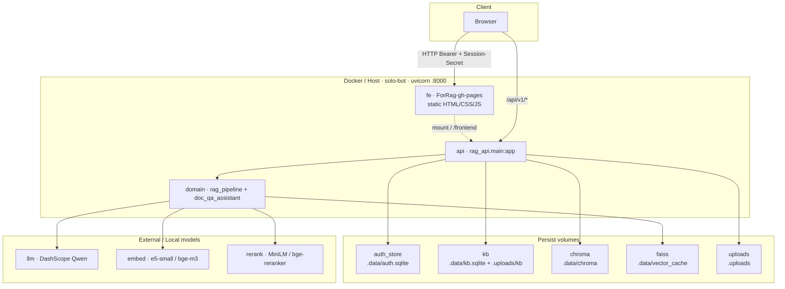
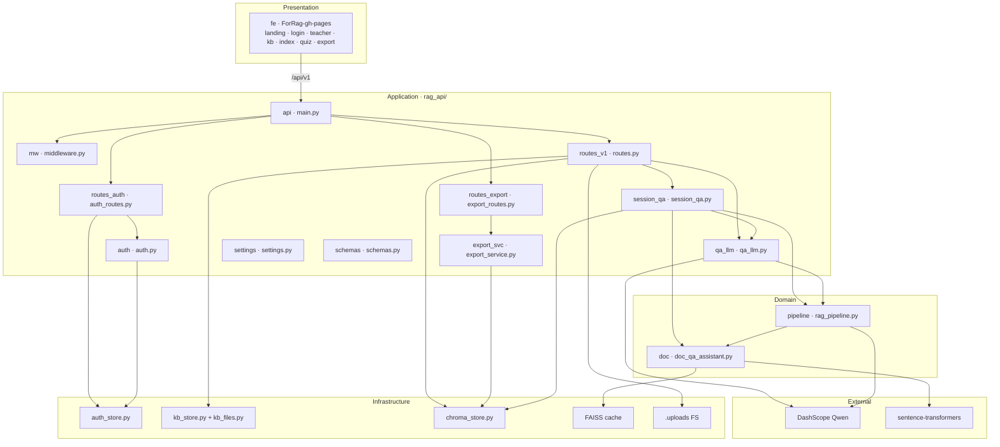
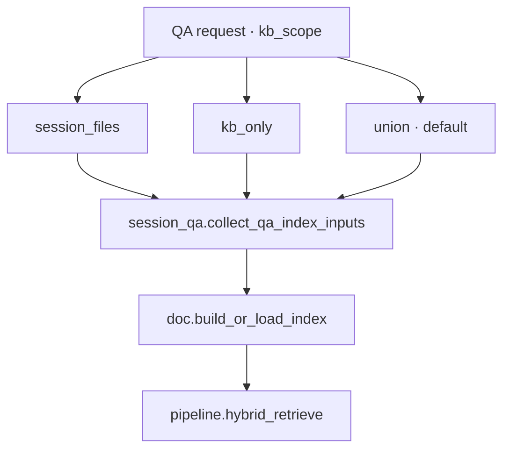
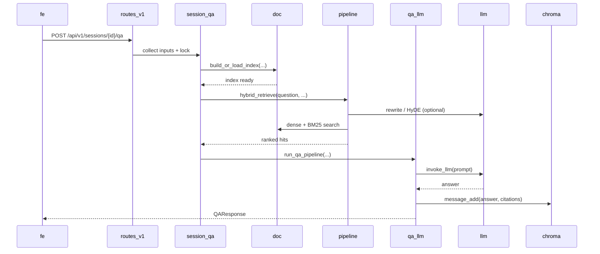
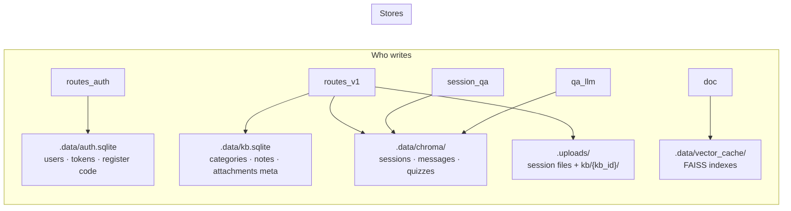
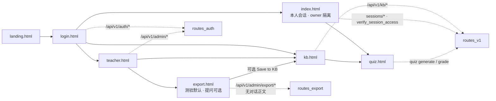

# ForRAG / SOLO Bot — 代码架构图

> **用途**：当前仓库的结构化架构真相源，供人读、IDE 预览，以及后续导出 PNG/SVG/交互图。  
> **产品名**：HKU Teacher-student Co-learning (SOLO) Bot · **工程代号**：ForRAG  
> **形态**：单进程 FastAPI + 静态前端 + 本地 FAISS/Embedding + 外部千问 API  
> **版本**：与代码对齐 · 2026-07-15  
> **关联**：[`ForRAG_PRD.md`](ForRAG_PRD.md) §5 · [`RAG_Optimization_Report.md`](RAG_Optimization_Report.md) · [`DEPLOY.md`](../DEPLOY.md)

---

## 如何可视化（后续）

| 方式 | 做法 |
|---|---|
| **即时预览** | VS Code / Cursor 装 Mermaid 插件，或 GitHub 直接渲染本文 ` ```mermaid ` 块 |
| **导出静态图** | `npx @mermaid-js/mermaid-cli -i docs/architecture.md -o docs/architecture-out/` |
| **程序化绘图** | 解析下方 `## Node Catalog` 的 YAML，节点 ID 与 Mermaid 图一致 |
| **推荐首图** | 先渲染 **§1 容器图** 与 **§3 RAG 主链路**；组件细节用 **§2** |

**约定**：所有图中的节点 `id` 与 `## Node Catalog` 对齐；后续加模块时先改 Catalog，再改图。

---

## Node Catalog（机器可读）

```yaml
# schema: forrag-arch-v1
# 后续可视化工具可只解析本块：id 稳定，layer / path / depends_on 用于布局与连线
system:
  name: SOLO Bot
  codename: ForRAG
  shape: monolithic-fastapi-static-ui
  entrypoints:
    - id: entry.uvicorn
      cmd: "uvicorn fastapi_service:app --host 0.0.0.0 --port 8000"
      path: fastapi_service.py
    - id: entry.rag_api
      cmd: "uvicorn rag_api.main:app"
      path: rag_api/main.py
    - id: entry.eval
      cmd: "python tools/rag_eval.py"
      path: tools/rag_eval.py
    - id: entry.docker
      cmd: "docker compose up -d"
      path: docker-compose.yml

nodes:
  # —— Presentation ——
  - id: fe
    name: ForRag-gh-pages
    layer: presentation
    path: ForRag-gh-pages/
    pages: [landing.html, login.html, teacher.html, kb.html, index.html, quiz.html, export.html]
    scripts: [auth.js, brand.js, app.js, kb.js]
    depends_on: [api]

  # —— Application ——
  - id: api
    name: FastAPI App
    layer: application
    path: rag_api/main.py
    depends_on: [mw, routes_v1, routes_auth, routes_export, settings]
  - id: mw
    name: Middleware
    layer: application
    path: rag_api/middleware.py
    notes: CORS · LoginRequired · PrivateNetworkAccess · rate limit
  - id: routes_v1
    name: v1 Routes
    layer: application
    path: rag_api/routes.py
    depends_on: [session_qa, qa_llm, chroma, kb, doc, auth]
  - id: routes_auth
    name: Auth / Admin Routes
    layer: application
    path: rag_api/auth_routes.py
    depends_on: [auth, auth_store]
  - id: routes_export
    name: Export Routes
    layer: application
    path: rag_api/export_routes.py
    depends_on: [export_svc, auth]
  - id: session_qa
    name: Session QA Orchestrator
    layer: application
    path: rag_api/session_qa.py
    depends_on: [doc, pipeline, qa_llm, chroma]
  - id: qa_llm
    name: QA / Quiz LLM
    layer: application
    path: rag_api/qa_llm.py
    depends_on: [pipeline, llm]
  - id: export_svc
    name: Export Service
    layer: application
    path: rag_api/export_service.py
    depends_on: [chroma]
  - id: settings
    name: Settings / Env
    layer: application
    path: rag_api/settings.py
  - id: schemas
    name: Pydantic Schemas
    layer: application
    path: rag_api/schemas.py
  - id: auth
    name: Auth Helpers
    layer: application
    path: rag_api/auth.py
    depends_on: [auth_store]

  # —— Domain ——
  - id: pipeline
    name: RAG Pipeline
    layer: domain
    path: rag_pipeline.py
    depends_on: [doc, llm]
    capabilities: [rewrite, hyde, hybrid_rrf, rerank, corrective]
  - id: doc
    name: Doc QA Assistant
    layer: domain
    path: doc_qa_assistant.py
    depends_on: [faiss, embed]
    capabilities: [parse, chunk, embed, faiss_index, search]

  # —— Infrastructure ——
  - id: auth_store
    name: Auth Store
    layer: infrastructure
    path: auth_store.py
    store: sqlite
    data_path: .data/auth.sqlite
  - id: kb
    name: KB Store + Files
    layer: infrastructure
    path: [kb_store.py, rag_api/kb_files.py]
    store: sqlite+fs
    data_path: [.data/kb.sqlite, .uploads/kb/]
  - id: chroma
    name: Chroma Store
    layer: infrastructure
    path: chroma_store.py
    store: chromadb
    data_path: .data/chroma/
    notes: sessions / messages / quizzes（非文档向量）
  - id: faiss
    name: FAISS Vector Cache
    layer: infrastructure
    path: .data/vector_cache/
    store: faiss
  - id: uploads
    name: Uploads FS
    layer: infrastructure
    path: .uploads/
    store: filesystem

  # —— External ——
  - id: llm
    name: DashScope Qwen API
    layer: external
    default_model: qwen-plus
    env: [DASHSCOPE_API_KEY, QWEN_API_MODEL, QWEN_API_BASE]
  - id: embed
    name: Local Embedding
    layer: external
    default_model: intfloat/multilingual-e5-small
    alt_models: [BAAI/bge-m3]
    runtime: sentence-transformers
  - id: rerank
    name: Cross-Encoder Reranker
    layer: external
    default_model: ms-marco-MiniLM-L-6-v2
    alt_models: [BAAI/bge-reranker-v2-m3]
    used_by: [pipeline]

  # —— Tools ——
  - id: eval
    name: Offline RAG Eval
    layer: tools
    path: tools/rag_eval.py
    depends_on: [doc, pipeline, qa_llm]

edges:
  - {from: fe, to: api, via: "HTTP /api/v1 + Bearer + X-Session-Secret"}
  - {from: api, to: mw, via: "request pipeline"}
  - {from: routes_v1, to: session_qa, via: "QA / quiz"}
  - {from: session_qa, to: doc, via: "build_or_load_index"}
  - {from: session_qa, to: pipeline, via: "hybrid_retrieve"}
  - {from: session_qa, to: qa_llm, via: "run_qa_pipeline"}
  - {from: pipeline, to: doc, via: "search / TextChunk"}
  - {from: pipeline, to: llm, via: "rewrite / HyDE / corrective"}
  - {from: qa_llm, to: llm, via: "invoke_llm"}
  - {from: doc, to: embed, via: "encode chunks"}
  - {from: doc, to: faiss, via: "index + cache"}
  - {from: routes_v1, to: chroma, via: "sessions/messages"}
  - {from: routes_v1, to: kb, via: "KB CRUD"}
  - {from: routes_auth, to: auth_store, via: "users/tokens"}
  - {from: routes_export, to: export_svc, via: "preview/download"}
```

---

## 1. 容器图（部署视角）

单容器 / 单进程：浏览器 → uvicorn → 本地数据卷 + 外部 LLM。



---

## 2. 分层组件图（代码职责）



### 2.1 目录 ↔ 组件速查

```text
For_RAG/
├─ fastapi_service.py          → entry.uvicorn（兼容 re-export）
├─ rag_api/                    → application
│  ├─ main.py                  → api
│  ├─ middleware.py            → mw
│  ├─ routes.py                → routes_v1（session / files / KB / QA / quiz）
│  ├─ auth_routes.py           → routes_auth（login / register / admin users）
│  ├─ export_routes.py         → routes_export（含 save-to-kb）
│  ├─ exercise_routes.py       → 课堂练习 import/list/publish + /quiz/{id}
│  ├─ exercise_service.py      → 题库 CSV/XLSX 解析、模板、AI 出题回流
│  ├─ session_qa.py            → session_qa（索引输入收集、异步 job、会话锁）
│  ├─ qa_llm.py                → qa_llm（CRAG 门控、LiM、引用、测验）
│  ├─ export_service.py        → export_svc
│  ├─ auth.py / schemas.py / settings.py / http_common.py
│  └─ kb_files.py / kb_migrate.py
├─ rag_pipeline.py             → pipeline
├─ doc_qa_assistant.py         → doc
├─ chroma_store.py             → chroma
├─ kb_store.py                 → kb（元数据）
├─ exercise_store.py           → class_exercises 表（kb.sqlite）
├─ auth_store.py               → auth_store
├─ ForRag-gh-pages/            → fe（kb.html 课堂练习、export Save to KB、quiz?quiz_id）
├─ tools/rag_eval.py           → eval
└─ Dockerfile / docker-compose.yml
```

**课堂练习闭环**：导出学生提问 → `Student questions` 笔记 → AI 生成题库（xlsx/csv）→ 发布 `class_exercises` → 学生 `quiz.html?quiz_id=` 作答。

**会话归属**：`http_common.verify_session_access` 在验 `X-Session-Secret` 之外，启用鉴权时要求 Bearer 用户 = 会话 `owner`；教师看全班数据仅经 `/admin/export/*`（提问 / 测验，不含对话正文）。前端侧栏键为 `RAG_CONVERSATIONS::<username>`。

---

## 3. RAG 主链路（数据流）

```mermaid
flowchart LR
  subgraph ingest["Ingest"]
    U["Upload / KB write"] --> P["doc.parse_*"]
    P --> C["token chunk + parent-child<br/>+ PDF OCR · cache v6"]
    C --> E["embed · e5-small / bge-m3"]
    E --> F["FAISS + parsed/docs cache"]
  end

  subgraph retrieve["Retrieve · pipeline.hybrid_retrieve"]
    Q["Question"] --> RW["Multi-query rewrite"]
    RW --> HY["HyDE"]
    HY --> DN["Dense FAISS"]
    HY --> BM["BM25"]
    DN --> RRF["RRF fusion"]
    BM --> RRF
    RRF --> RR["Cross-encoder rerank"]
    RR --> COR["Corrective re-query ≤1"]
  end

  subgraph generate["Generate · qa_llm.run_qa_pipeline"]
    COR --> CRAG["CRAG gate + sufficiency<br/>none / weak / grounded"]
    CRAG --> LIM["Lost-in-the-Middle"]
    LIM --> GEN["invoke_llm · Qwen<br/>RAG or general"]
    GEN --> CIT["sentence [n] + coverage<br/>+ source footer"]
    CIT --> MSG["chroma.message_add"]
  end

  F --> Q
```



### 3.1 检索范围（kb_scope）



---

## 4. 问答时序（同步路径）



异步路径：`POST .../qa/async` → 内存 job → 轮询 `GET .../qa/jobs/{job_id}`（进程内，非多 worker 共享）。

---

## 5. 持久化与写路径

> **注意**：Chroma 存会话/消息/测验元数据；**文档向量在 FAISS**，不在 Chroma collection。



| 数据 | 存储 | 默认路径 | 写入方 |
|---|---|---|---|
| 用户 / 令牌 / 注册码 | SQLite | `.data/auth.sqlite` | `auth_store` ← auth routes |
| KB 元数据 | SQLite | `.data/kb.sqlite` | `kb_store` ← v1 routes |
| 原文件 | FS | `.uploads/` | routes / `kb_files` |
| 会话 · 消息 · 测验 | ChromaDB | `.data/chroma/` | `chroma_store` |
| 向量索引 | FAISS | `.data/vector_cache/` | `doc_qa_assistant` |

备份 / 迁移须同时保留 **`.data`** 与 **`.uploads`**。

---

## 6. 前端页面 ↔ API 能力



| 页面 | 主要脚本 | 后端焦点 |
|---|---|---|
| `landing.html` | `brand.js` | 静态 |
| `login.html` | `auth.js` | `routes_auth` |
| `teacher.html` | `auth.js` | admin users + reg code |
| `kb.html` | `kb.js` | KB CRUD（教师写 / 学生读） |
| `index.html` | `app.js` | session · upload · QA（owner 隔离；侧栏按用户名分区） |
| `quiz.html` | `app.js` | quiz generate / grade |
| `export.html` | — | `routes_export`（提问 / 测验；默认测验） |

---

## 7. 调用边界（谁可以依赖谁）

```text
允许方向（上层 → 下层）：

  fe  →  api/routes
  routes  →  session_qa / qa_llm / stores / doc（invalidate）
  session_qa  →  doc + pipeline + qa_llm + chroma
  pipeline  →  doc.search + inject invoke_llm
  qa_llm  →  llm + pipeline.build_citations
  stores  →  （叶节点，不回调 routes）

禁止：
  · 前端直接读写 SQLite / Chroma / FAISS
  · store 反向 import routes
  · 多 worker 共享内存 QA job（当前设计为单进程）
```

---

## 8. 技术栈一览

| 层 | 技术 |
|---|---|
| 语言 | Python 3.12（conda env `forrag`） |
| API | FastAPI · Uvicorn · Pydantic v2 |
| 前端 | 原生 HTML/CSS/JS（无 Node 构建） |
| 元数据 | SQLite ×2 · ChromaDB |
| 向量 | FAISS 磁盘缓存 |
| 嵌入 / 重排 | sentence-transformers · CrossEncoder |
| 生成 | OpenAI SDK → DashScope 兼容接口 |
| 解析 | PyMuPDF · python-docx · openpyxl · python-pptx · RapidOCR |
| 部署 | Docker Compose 单服务 `solo-bot` |
| 评测 | `tools/rag_eval.py` + pytest |

---

## 9. 后续出图检查清单

导出可视化时建议固定这 4 张：

1. **§1 容器图** — 给产品 / 运维看边界  
2. **§2 分层组件图** — 给研发看模块归属  
3. **§3 RAG 主链路** — 给算法 / 优化看数据流  
4. **§4 问答时序** — 给联调 / 排障看调用链  

改代码后：先更新 **Node Catalog** 的 `nodes` / `edges`，再同步对应 Mermaid 块，保持 `id` 不变以便 diff。
